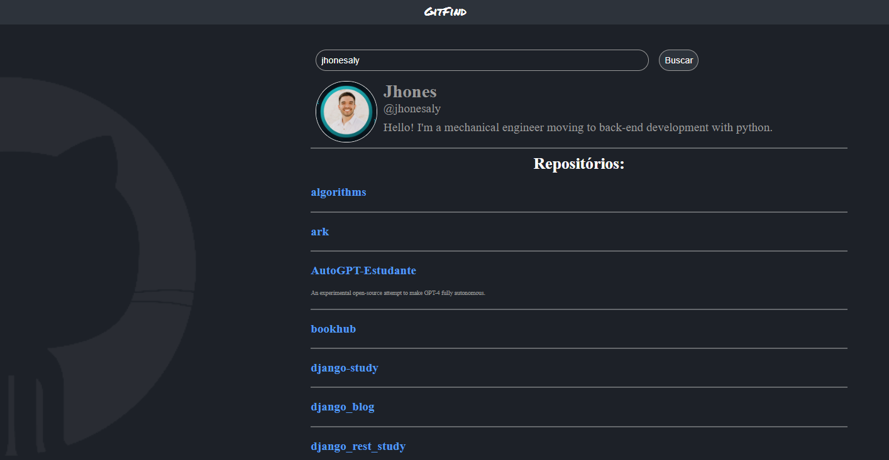

# GitFind

## Descrição
GitFind é uma aplicação React que permite buscar usuários do GitHub e exibir informações sobre eles, incluindo seus repositórios.

## Como Usar
Siga as instruções abaixo para executar o projeto localmente em seu ambiente de desenvolvimento.

### Pré-requisitos
- Node.js instalado
- npm (gerenciador de pacotes do Node.js) instalado

### Instalação
1. Clone este repositório em sua máquina local:

   ```bash
   git clone https://github.com/seu-usuario/gitfind.git
   ```

2. Navegue até o diretório do projeto:

   ```bash
   cd gitfind
   ```

3. Instale as dependências:

   ```bash
   npm install
   ```

### Execução
1. Inicie o aplicativo:

   ```bash
   npm start
   ```

2. Acesse [http://localhost:3000](http://localhost:3000) no seu navegador.

3. Insira o nome de usuário do GitHub na caixa de pesquisa e clique em "Buscar".

4. Veja as informações do usuário e seus repositórios, se disponíveis.



## Estrutura do Projeto
- `src/index.js`: Ponto de entrada da aplicação.
- `pages/Home/index.js`: Componente principal que contém a lógica da aplicação.
- Outros arquivos: Contêm componentes, estilos e assets necessários.

## Tecnologias Utilizadas
- React
- JavaScript
- HTML
- CSS

## Autor
Alyson Jhones

---

Por favor, ajuste o README conforme necessário e me avise se precisar de mais alguma coisa!